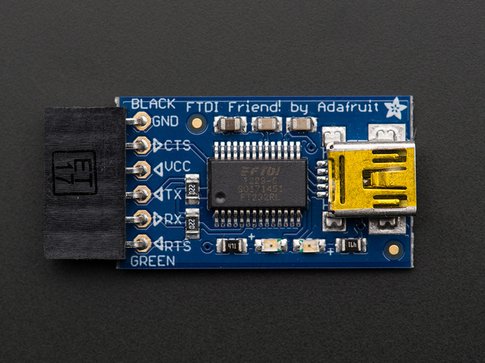

# การเริ่มต้นใช้งาน ESP8266 ผ่านทาง Arduino IDE (ตอนที่ 2 – การ flash โปรแกรมลงบน ESP8266 ใช้บอร์ด ESPresso Lite V2.0)

**อุปกรณ์ที่ใช้ในการทดสอบ**

1.ในการทดสอบครั้งนี้ผมใช้ ESPresso Lite V2.0 ของ Espert

2.ตัว flash ใช้ FT232 เชื่อมต่อแบบ UART ถ้าใช้ บอร์ด NodeMCUและ WeMos ก็ไม่จำเป็นต้องใช้เจ้าตัวนี้ครับ

FTDI หรือ FT232 เป็น ตัวเชื่อมต่อสื่อสาร ระหว่าง คอมพิวเตอร์กับ บอร์ด ESPresso Lite V2.0 มีเพียงตัวนี้ก็สามารถ อัพโหลดโปรแกรม หรือ Debug โปรแกรมของ ESPresslite ได้ทุกตัว

**ขั้นตอนการทดสอบ**
1.ใช้โปรแกรมตัวอย่างจาก Library ของ ESPert ในการ