# ติดตั้ง Arduino IDE กับ ESP8266และ โปรแกรมตัวอย่าง Library

### ขั้นตอนการติดตั้ง Arduino IDE กับ ESP8266

การติดตั้ง Arduino IDE กับ ESP8266 คือการติดตั้งโปรแกรมเพื่อใช้ในการเขียนโปรแกรมให้กับบอร์ด ESP8266 หรือบอร์ดอื่น ๆ ผ่านทาง Arduino ใช้ภาษาหลักการของภาษา C++ ครอบด้วยภาษาของ Aruino เพื่อให้การเขียนโปรแกรมมีความง่ายมากยิ่งขึ้น

1.ติดตั้ง Arduino IDE เวอร์ชั้น 1.6.5 หรือ ใหม่กว่า โดย Arduino IDE สามารถ Support  Windows Mac OS X Linux ทั้ง 32bit และ 64 bit ซึ่งหา Download ตัวติดตั้งได้จาก [https://www.arduino.cc/en/main/software](https://www.arduino.cc/en/main/software)

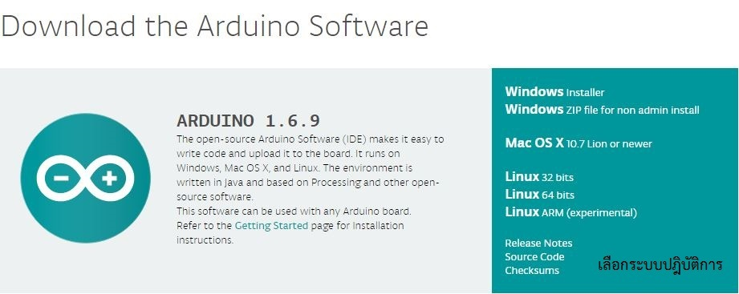
 

สำหรับการติดตั้ง Arduino IDE บน Windows จะมีแบบให้เลือกทั้ง แตกไฟล์ใช้ได้เลย (ZIP file for non admin install)หรือ ติดตั้งเหมือน โปรแกรมทั่วๆไป (Installer) หากติดตั้งเรียบร้อยแล้ว ให้เปิด Arduino IDE ขึ้นมาจะได้หน้าตาแบบนี้เลยครับ

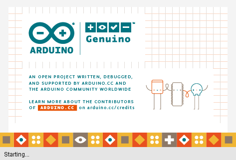

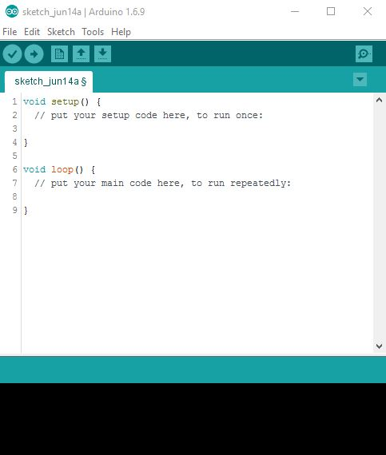

2.ติดตั้ง Broad ESP8266 ลงบน Arduino IDE
  * กดเลือก Menu ไปที่ **File** >> **Preferences**
  
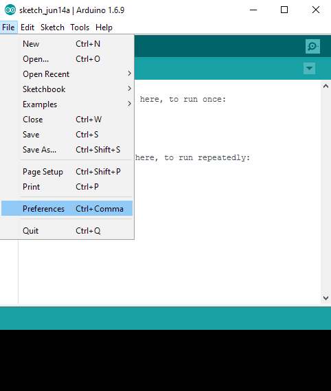

  * จะขึ้นหน้าต่าง Preferences  ให้สังเกตุในช่อง Additional Board Manger URLs:
 
  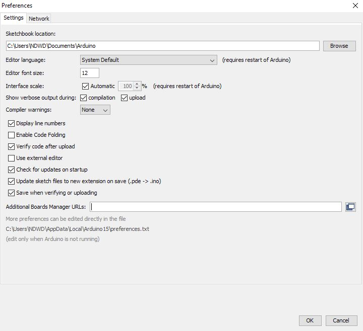
  
  ในส่วนของ Additional Board Manger  บทความนี้ผมจะใช้ Boards Manager ของ Community ESP8266
  
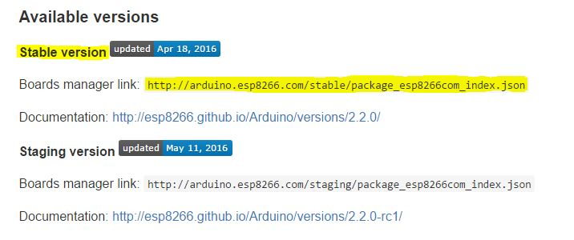
  * ใส่ URL >> ลงใน Addition Board Manager URLs: ดังนี้ [http://arduino.esp8266.com/stable/package_esp8266com_index.json](https://github.com/esp8266/Arduino)
  
  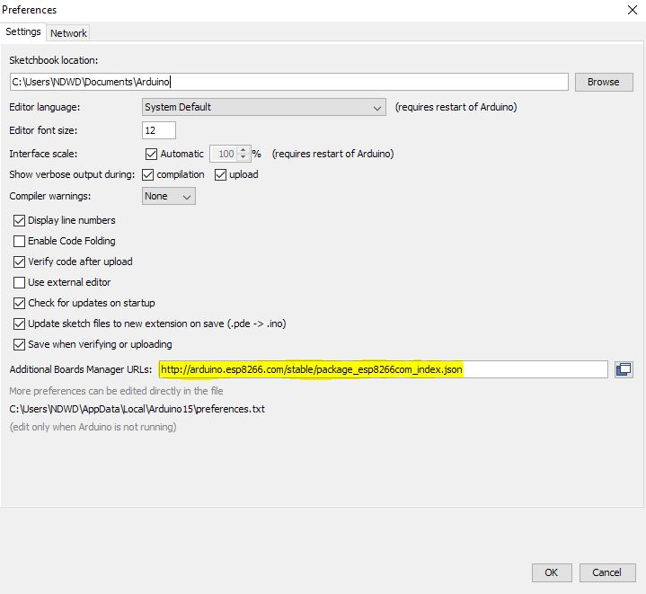
  
  จากนั้นกด OK

  * ไปที่ Menu Tools >> Boar: “Arduino…” >> Board Manager…
  
   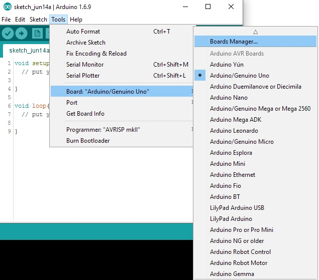

* จะขึ้นหน้าต่าง Boards Manager เลือก Type เป็น Contributed
  
  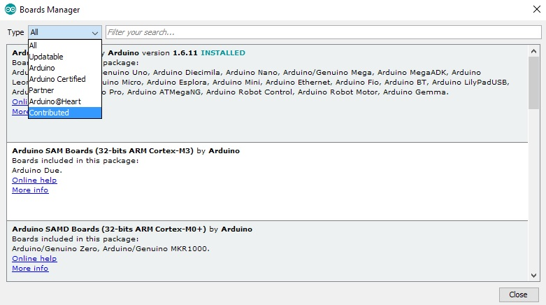
  
  * จะแสดง Boards ของ ESP8266 เลือกเวอร์ชัน 2.2.0 หรือใหม่กว่าในอนาคต Boards และกด Install 

  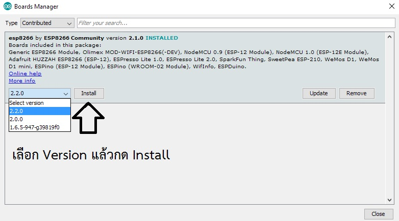
  
  * แล้วรอ สัก 2-3 ครู่ ตัวโปรแกรมจะโหลด Boards ESP8266 ให้ ขนาดไฟล์ประมาณ 150 MB และติดตั้งให้เอง
  
  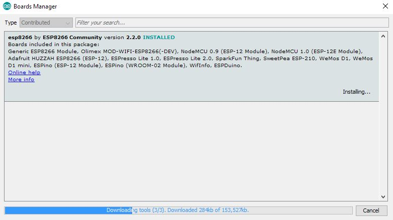
  
  เมื่อเราติดตั้งบอร์ด ESP8266 เสร็จเรียบร้อยแล้ว ให้ปิดโปรแกรม Arduino IDE ก่อน แล้วจึงเปิดขึ้นมาใหม่
  * เมื่อเปิดโปรแกรม Arduino IDE ขึ้นมาใหม่แล้ว ให้ลองเลือกไปที่ Menu Tools >> Board: “…..” ซึ่งจะพบว่า มี Menu สำหรับเลือกใช้งาน ESP8266 กับ Arduino IDE ขึ้นมาให้เลือกใช้งานแล้วครับ

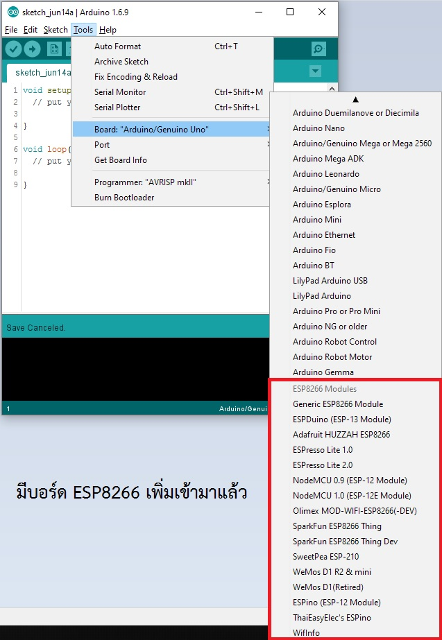

  ซึ่ง หมวดของ ESP8266 Modules นั้นจะมีบอร์ดให้เลือกใช้งานอยู่ด้วยกันหลายบอร์ด ที่มีจำหน่ายทั่ว ๆ ไป เช่น
  
  - Generic ESP8266 Module >> บอร์ด ESP8266 ที่ใช้งานทั้วไป หรือ บอร์ดที่สร้างขึ้นเอง
  - ESPresso Lite 1.0 และ 2.0 >> บอร์ด ESP8266 ของ Espert และ Chiangmai Maker Club 
  - Olimex MOD-WIFI-ESP8266(-DEV) >> บอร์ด ESP8366 ที่บริษัท Olimex เป็นผู้สร้าง
  - NodeMCU (ESP8266 ESP-12 Module) >> บอร์ด ESP8266 ที่เป็นบอร์ด NodeMCU
  - WeMos D1 >> บอร์ด ESP8266 ที่เป็นบอร์ด wemos

ซึ่งถ้าหากเรามีบอร์ด ESP8266 ที่รองรับ โมดูล ทั้ง 3 บอร์ด ก็สามารถใช้งานได้เลย
บอร์ดรุ่นต่าง ๆ ที่ใช้งานโดยทั่วๆไป ก็มีดังนี้

1.Generic ESP8266 Module

 

2.ESPresso Lite 1.0 และ 2.0 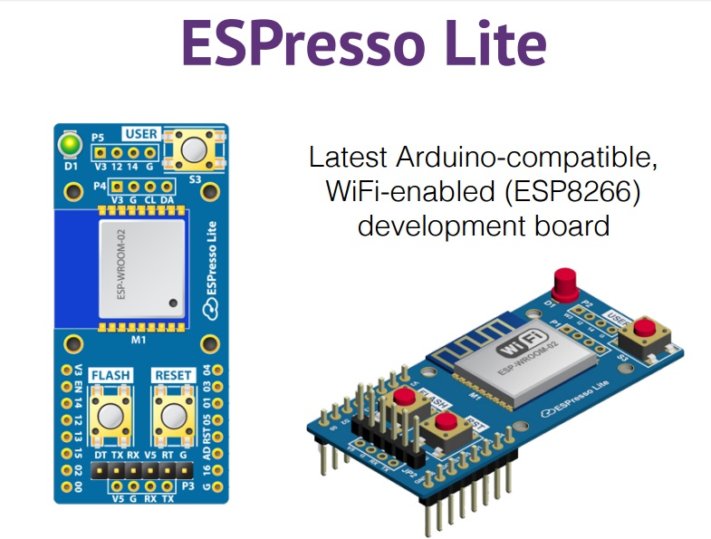
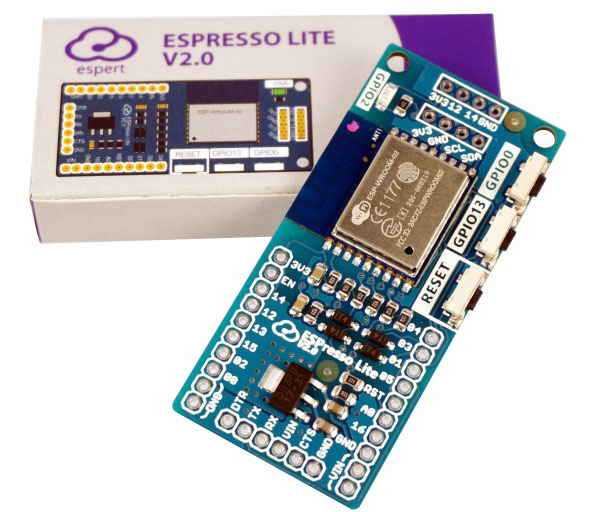

3.NodeMCU

4.WeMos

เพียงเท่านี้เราก็สามารถใช้งาน Board ESP8266 บน Arduino IDE ได้ครบแล้วครับ

ปล.บอร์ด ESPresso Lite V2.0 สามารถสั่งซื้อออนไลน์ได้จากเว็บไซต์ของเชียงใหม่เมกเกอร์คลับ [คลิ๊ก](http://www.cmmcshop.com/category)
และ สามารถซื้อด้วยตนเอง 

กทม. :
Pinn Creative Space สาขา The shoppes grand rama 9 ชั้น 2[ Map](https://maps.here.com/directions/mix/mylocation/PINN-Creative-Space:13.759915,100.569588?map=13.75991,100.56959,15,normal&fb_locale=th_TH)

เชียงใหม่ :
ชมรมเชียงใหม่เมกเกอร์คลับ 81/21-25 ถ.อารักษ์ ต.สุเทพ อ.เมืองเชียงใหม่ จ.เชียงใหม่ 50200 [Map](https://www.google.com/maps?ll=18.783329,98.978965&z=19&t=m&hl=th&gl=TH&mapclient=embed&cid=5283136291489251162)

