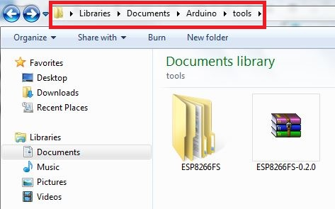
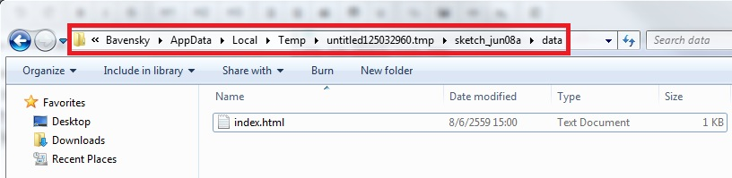
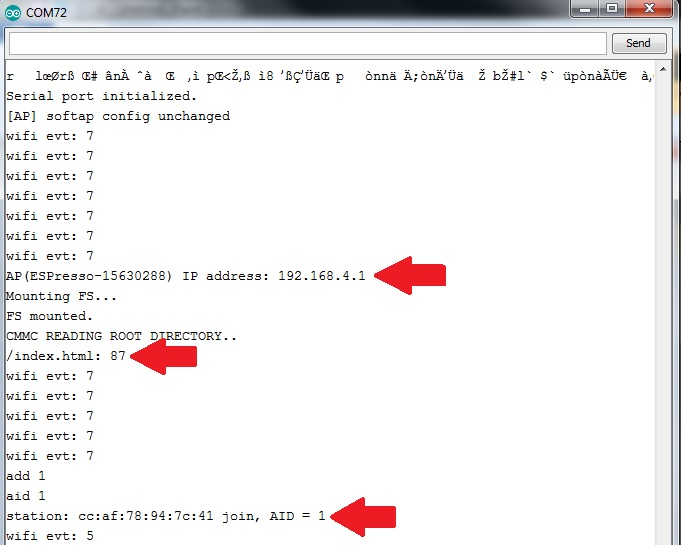
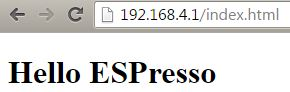

# File  System

## Table of Contents
  * [Uploading files to file system](#uploading-files-to-file-system)
  * [Flash layout](#flash-layout)

## การอัพโหลดไฟล์ขึ้น ESPresso Lite โดยใช้ ESP8266FS

*ESP8266FS* is a tool which integrates into the Arduino IDE. It adds a menu item to *Tools* menu for uploading the contents of sketch data directory into ESP8266 flash file system.

- ดาวน์โหลดเครื่องมืออัพโหลดไฟล์: https://github.com/esp8266/arduino-esp8266fs-plugin/releases/download/0.2.0/ESP8266FS-0.2.0.zip.
- แตกไฟล์เข้าไปที่โฟล์เดอร์ `<home_dir>Documents/Arduino/tools/ESP8266FS/tool/esp8266fs.jar`

- Restart Arduino IDE
- เปิดหรือสร้าง Arduino Sketch ขึ้นมา และเข้าไปโปรเจ็ค (เลือกเมนู Sketch > Show Sketch Folder) 

- สร้างโฟล์เดอร์ `data` ขึ้นมา และเอาไฟล์ที่ต้องการอัพโหลดเข้าไปใน ESPresso Lite วางไว้ใน `data`

ทดลองสร้างโค้ดตัวอย่างใน index.html

    <!DOCTYPE html>
    <html lang="en">
    <head></head>
    <body>
        <h1>Hello ESPresso</h1>
    </body>

- เลือกบอร์ดให้ถูกต้อง และปิด Serial Monitors
- เลือกเมนู Tools > ESP8266 Sketch Data Upload. เมื่ออัพโหลดเสร็จแล้วจะขึ้นว่า  `SPIFFS Image Uploaded` 
- เปิด Serial port ดูสถานะต่าง ๆ 
  - AP (..........) คือชื่อ wifi ที่ปล่อยออกไปให้เราเชื่อมต่อ
  - เข้าเว็บเบราเซอร์ด้วย IP : 192.168.4.1
  - โค้ดตัวอย่างจะอ่านไฟล์ใน SPIFFS จะเจอ index.html ที่อัพโหลดลงไป
  - แสดงสถานะการเชื่อมต่อของเราเข้ามาใน Serial port

- ลองเข้า IP : 192.168.4.1 ผลที่ได้ดังภาพด้านล่าง

 
- อัพโหลดโค้ดตัวอย่าง
  
  [จากหน้านี้](webserver_serve_static_files.md)