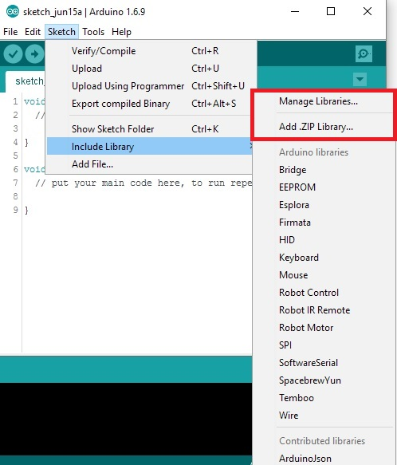
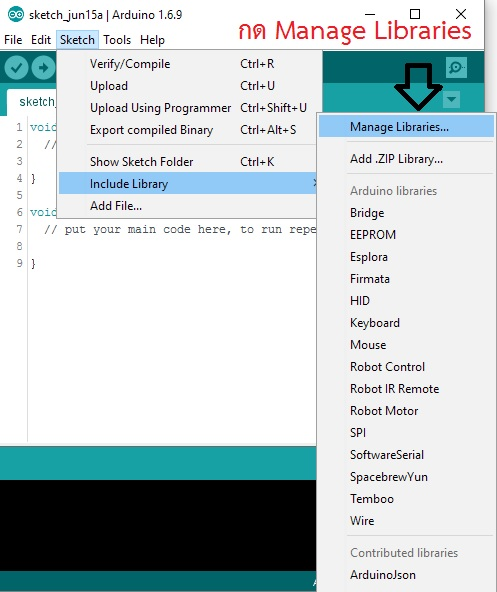
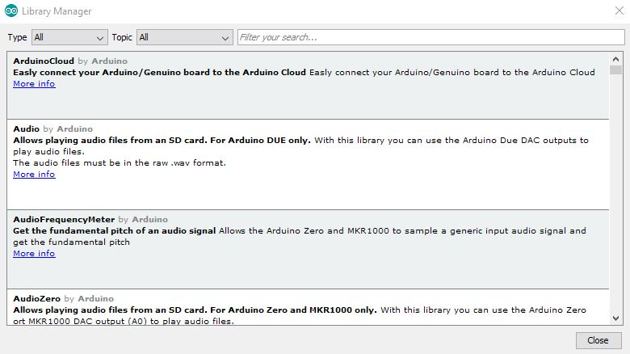
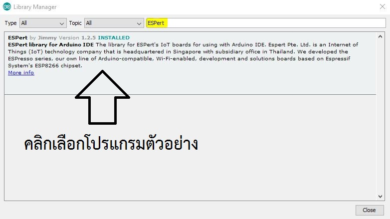
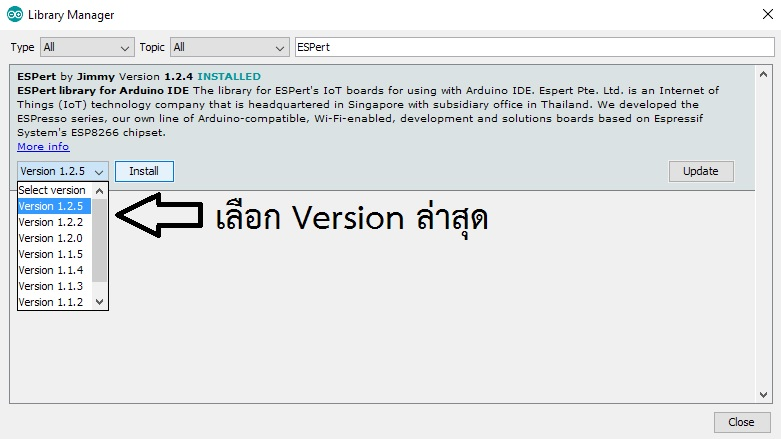
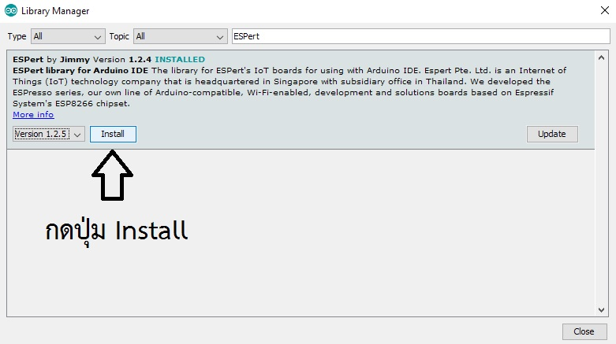
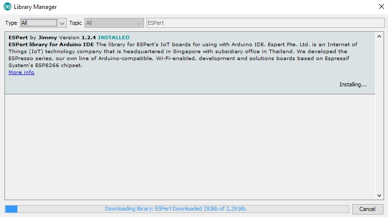
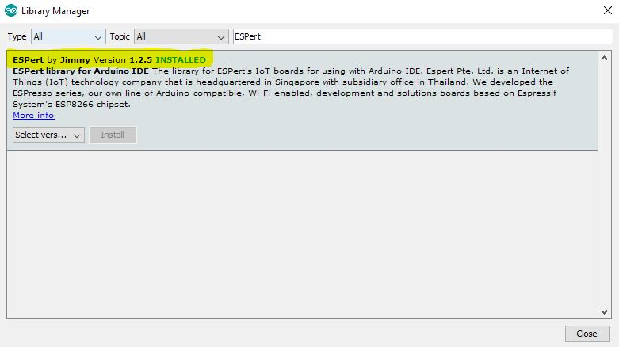
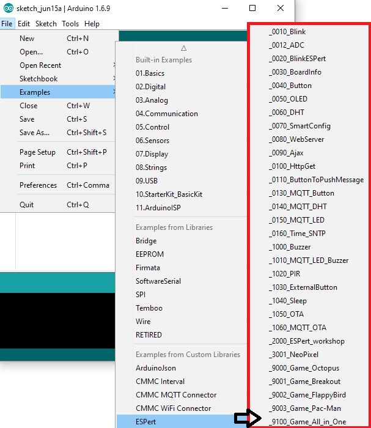

# ขั้นตอนการติดตั้งโปรแกรมตัวอย่าง Library

การติดตั้งโปรแกรมตัวอย่าง คือ การลงโปรแกรมเสริม หรือ Code สำหรับใช้งานกับ Shield โมดูล หรือ เซนเซอร์ต่าง ๆ ที่ผู้พัฒนาได้มีการพัฒนาให้บอร์ดสามารถใช้งานได้กับอุปกรณ์ต่าง ๆ ที่มีออกมาจำหน่ายอย่างต่อเนื่องซึ่งจำเป็นกับผู้เริ่มต้น เนื่องจากทำให้ผู้ใช้งานประหยัดเวลา มีความสะดวกและ ง่ายมากยิ่งขึ้นในการพัฒนา โดยมีการเพิ่ม Library อยู่ 2 แบบหลักคือ 

1. การเพิ่ม Library โดยวิธี Manage Libraries...
2. การเพิ่ม Library โดยวิธี Add.ZIP Library...

โดยการเลือกใช้งาน เมนู Sketch >> Include Library >> ... ดังรูป
 

**1. การเพิ่ม Library โดยวิธี Manage Libraries...**
เป็นการเพิ่ม Library โดยตรงจากเซิฟเวอร์ของทาง Arduino ซึ่ง Manage Libraries จากผู้พัฒนาก่อนจะถูกอัพขึ้นเซิฟเวอร์ของ Arduino จะมีคนคอยตรวจสอบก่อนเสมอ จึงเป็นสากลมากกว่าการลงแบบ Manual และใช้งานได้จริง

* ทดลองลงโปรแกรมตัวอย่างจาก Library ของ ESPert แบบ Manage Libraries... จะมีลักษณะคล้ายกับการลง Broad ESP8266 ข้างต้น 

      ซึ่ง "จำเป็นต้องเชื่อมต่อคอมพิวเตอร์กับ Internet ก่อนการเพิ่ม Library โดยวิธีนี้เสมอ"

* โดยการเลือกใช้งานเมนูSketch >> Include Library >> Manage Libraries

* โปรแกรมจะแสดงหน้าต่างใหม่ขึ้นมาดังรูป

* ในช่องค้นหาใส่ Library ที่ต้องการเพิ่ม ในที่นี้จะค้นหา Library ของ ESPert ตามรูปที่เน้นคำและ คลิกเลือกโปรแกรมที่ค้นหา

 * เลือก Version ล่าสุด หรือ ในขณะนี้อัพเดทล่าสุดที่ Version 1.2.5 

  * กดปุ่ม Install เพื่อเริ่มติดตั้ง Library ลงบน Arduino IDE

  * โปรแกรมจะทำการติดตั้ง Library อัตโนมัติจาก Sever ผ่าน Internet

* โปรแกรมจะแสดงข้อความ INSTALLED ตรงไฮไลท์ตามรูปแสดงว่าเพิ่มโปรแกรมตัวอย่างเรียบร้อยแล้ว

* การเรียกใช้งานโปรแกรมตัวอย่างโดยเข้าไปที่
    
    File >> Examples >> ESPert >> ....

**Library ที่จำเป็นกับ ESPresso Lite V2.0**

| Library                         | by              | current version |
| ------------------------------- | --------------- | --------------- |
| Adafruit NeoPixel               | Adafruit        | 1.0.5    |
| ArduinoJson                     | Benoit Blanchon | 5.5.0    |
| DHT sensor library              | Adafruit        | 1.2.3    |
| ESP8266 Oled Driver for SSD1306 | Daniel Eichborn | 3.0.0    |
| DHT sensor library              | Adafruit        | 1.2.3    |
| HttpClient                      | Adrian McEwen   | 2.2.0    |
| PubSubClient                    | Nick O'Leary    | 2.6.0    |

ควรอัพเดท Board Manager และ Library ให้เป็นเวอร์ชันล่าสุดอยู่เสมอ